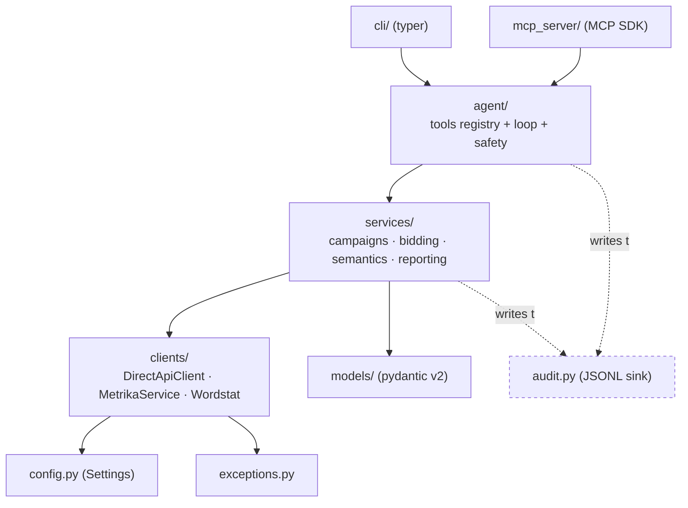

# yadirect-agent

> Autonomous AI agent for Yandex.Direct and Yandex.Metrika — with safety rails, audit trail, and a plan→confirm→execute policy.

[](https://www.python.org/)
[](./LICENSE)
[](https://github.com/Kozharina/yadirect-agent/actions/workflows/ci.yml)
[](https://github.com/astral-sh/ruff)
[](https://mypy-lang.org/)

`yadirect-agent` is a Python agent that plans, executes, and audits changes
in a Yandex.Direct advertising account. It runs in two interchangeable modes:

- **CLI agent** (`yadirect-agent`) — a scheduled or ad-hoc executor driven by
  a natural-language task. Uses Anthropic's Claude with tool use.
- **MCP server** (`yadirect-mcp`) — an interactive adapter for Claude Desktop
  / Claude Code. Same tools, same safety layer, different transport.

Both modes share the core (`clients/`, `models/`, `services/`, `agent/`) and
the same `agent_policy.yml` safety configuration.

## Status

**Pre-alpha — M0 in progress.** See [`docs/TECHNICAL_SPEC.md`](./docs/TECHNICAL_SPEC.md)
for the full roadmap (M0 → M7) and [`docs/PRIOR_ART.md`](./docs/PRIOR_ART.md)
for references consulted per milestone.

## Quickstart

Requires Python 3.11+. We recommend [uv](https://github.com/astral-sh/uv):

```bash
# 1. Clone and set up
git clone git@github.com:Kozharina/yadirect-agent.git
cd yadirect-agent

# 2. Create a virtualenv and install dev dependencies
uv venv --python 3.11
source .venv/bin/activate
uv pip install -e ".[dev]"

# 3. Configure
cp .env.example .env
# edit .env — at minimum: ANTHROPIC_API_KEY, YANDEX_DIRECT_TOKEN,
# YANDEX_METRIKA_TOKEN. Keep YANDEX_USE_SANDBOX=true until you've
# verified everything.

# 4. Run the test suite
make test
```

Once M1 lands:

```bash
# Ad-hoc CLI run
yadirect-agent run "list all campaigns in sandbox and identify ones with low CTR"

# Interactive
yadirect-agent chat

# As an MCP server for Claude Desktop
yadirect-mcp
```

## Architecture

Six layers, strictly stacked. Lower layers never depend on higher layers.



See [`docs/ARCHITECTURE.md`](./docs/ARCHITECTURE.md) for the contract of each
layer and the dependency rules enforced in code review.

## Safety model

Three layers, each of which can independently block an operation:

1. **Sandbox by default.** `YANDEX_USE_SANDBOX=true` hits
   `api-sandbox.direct.yandex.com` and cannot spend real money. Production
   requires explicit human flip.
2. **Plan → Confirm → Execute.** Every mutating operation is first serialized
   into an `OperationPlan`, checked against `agent_policy.yml`
   (budget caps, max CPC, bulk-size limits, required negative keywords,
   quality-score guardrail, conversion-integrity check, query-drift detector),
   and only then executed. Policy cannot be overridden from the model's
   context — only by a human editing the file.
3. **Audit log.** Every action is appended to `logs/audit.jsonl` with
   `trace_id`, timestamps, request/response shapes, and a reversibility
   marker. The log is append-only and must not contain secrets.

Staged rollout (from `shadow` → `assist` → `autonomy light` → `autonomy full`)
is governed by `rollout_stage` in `agent_policy.yml` and takes a minimum of
30 days, gated by explicit success criteria per stage.

More: [`docs/TECHNICAL_SPEC.md` §M2](./docs/TECHNICAL_SPEC.md).

## For contributors

- [`docs/CODING_RULES.md`](./docs/CODING_RULES.md) — non-negotiables: async,
  strict types, no business logic in clients, SecretStr, no silent excepts.
- [`docs/TESTING.md`](./docs/TESTING.md) — unit vs. http vs. vcr testing
  layers, fixtures, coverage targets.
- [`docs/REVIEW.md`](./docs/REVIEW.md) — checklist the reviewer (and Claude)
  walks through before approving a PR.
- [`CLAUDE.md`](./CLAUDE.md) — operational protocol Claude Code follows
  inside this repo: how tasks are decomposed, what must precede a commit,
  what requires human confirmation.

## License

MIT — see [`LICENSE`](./LICENSE).
